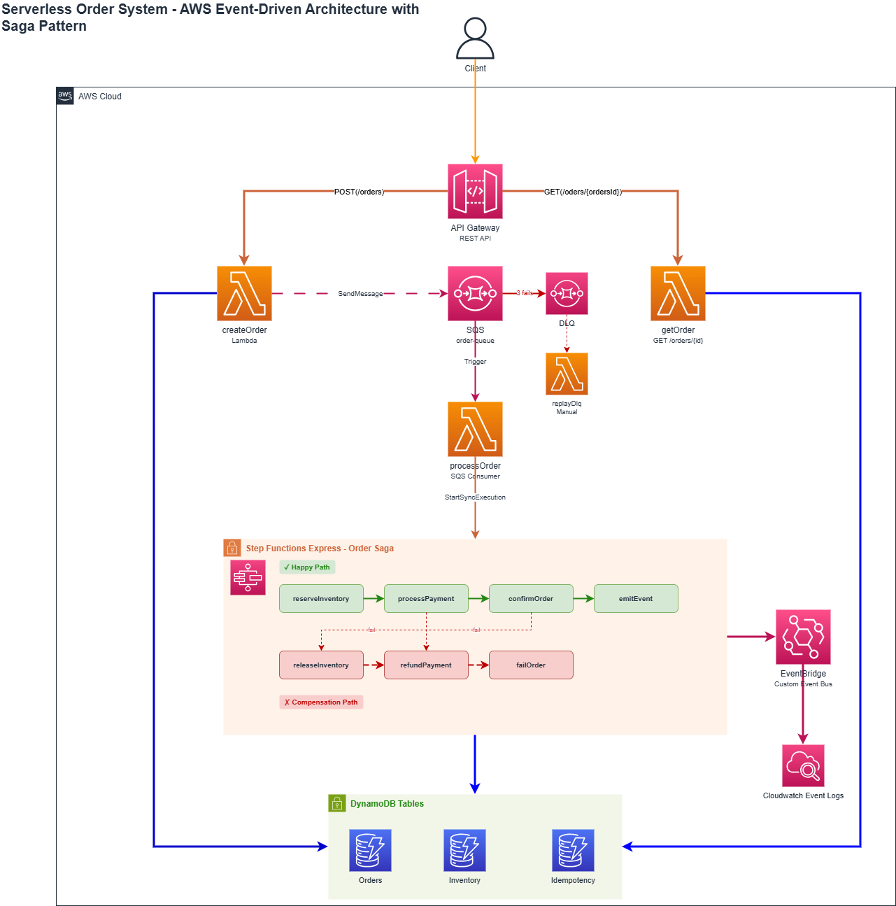
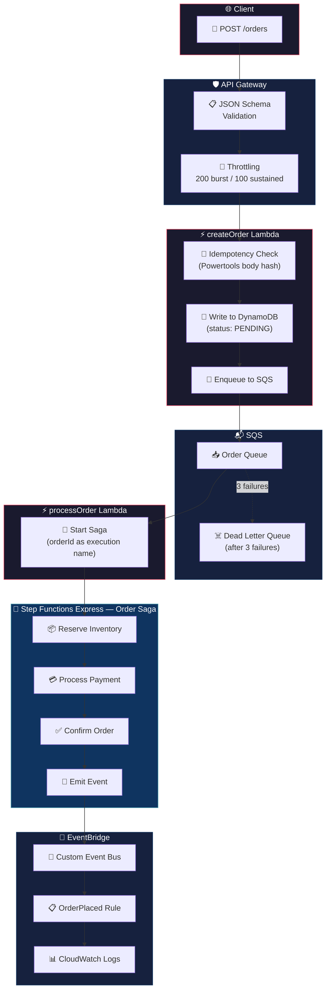
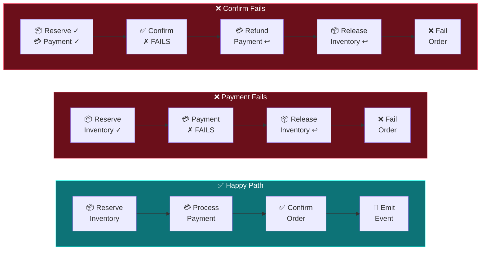
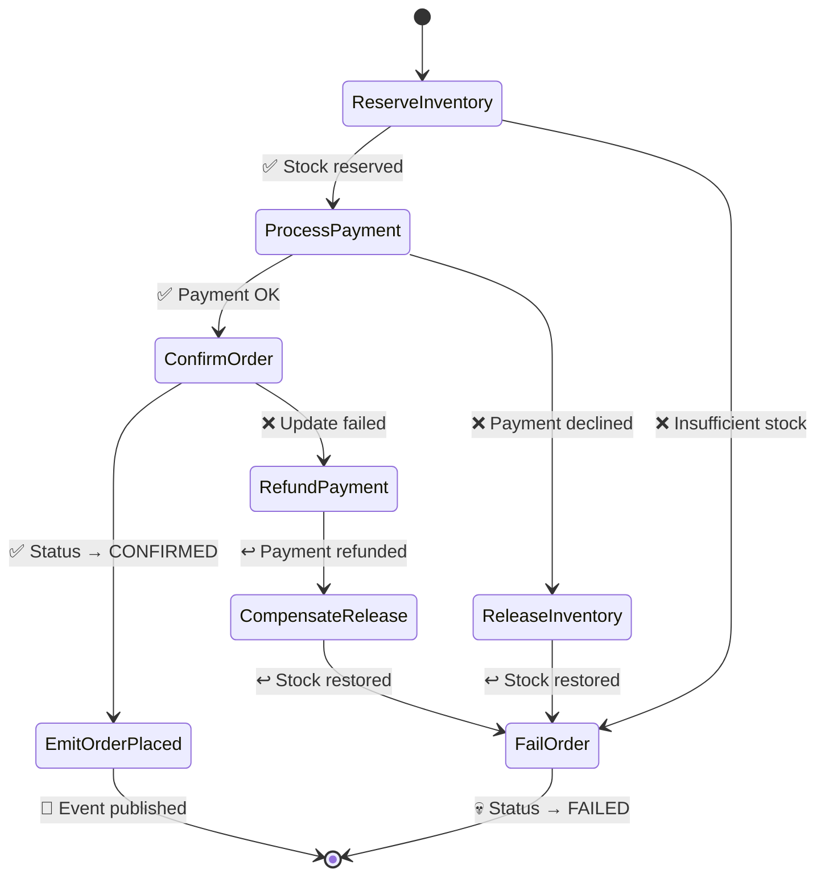
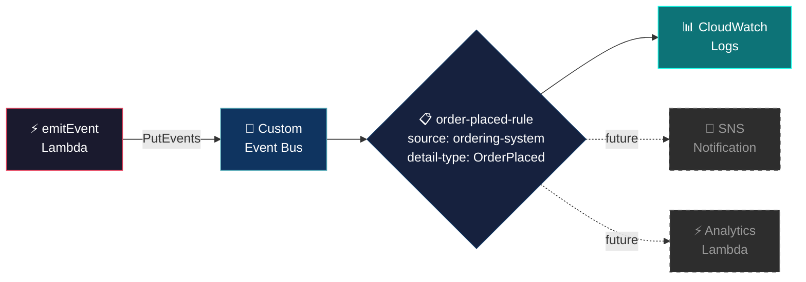
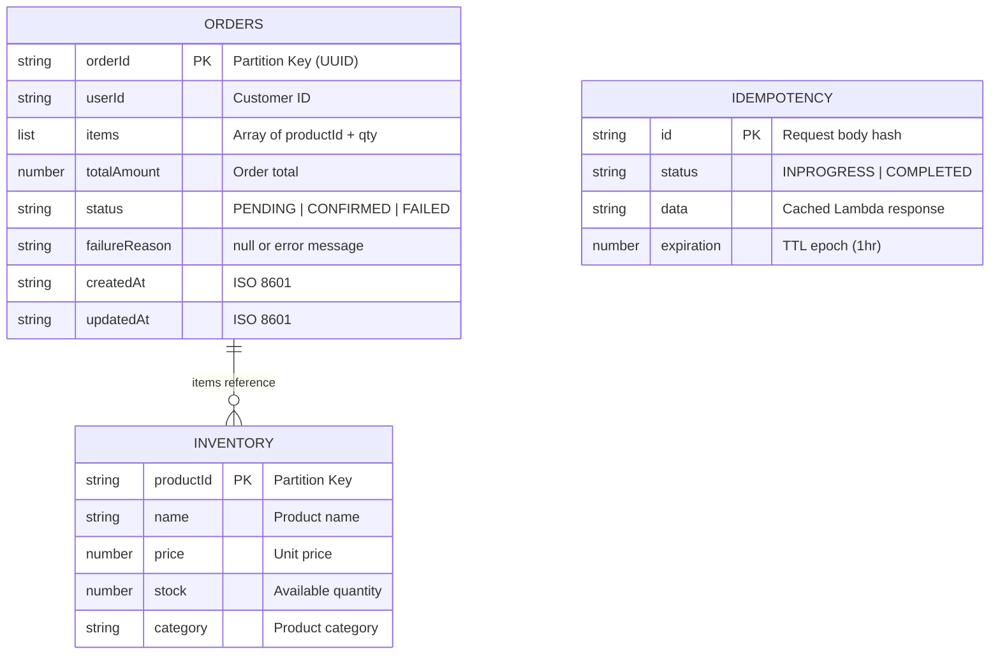

<div align="center">

# ⚡ Serverless Ordering System

### High-Scale Event-Driven Order Processing on AWS


A production-grade, event-driven order processing pipeline built entirely on AWS serverless services. Designed to handle **10,000+ orders/min** using the **Saga pattern** for distributed transactions with automatic compensation on failure.

*Demonstrates distributed systems design, serverless architecture, Infrastructure as Code, and event-driven patterns.*

---

</div>

## 📐 Architecture Overview

The system follows an **event-driven microservices** architecture where each component is decoupled through queues and events. A client submits an order via REST API, and the system asynchronously orchestrates inventory reservation, payment processing, order confirmation, and domain event publishing — all with automatic rollback if anything fails.



### 🔄 End-to-End Request Flow



### 🛡️ Saga Compensation — Automatic Rollback

When a step fails, the saga doesn't just stop — it **undoes** everything that succeeded before it. This guarantees data consistency across services without distributed locks.



Each state has **3 retries** with exponential backoff (2s → 4s → 8s) before triggering compensation.

---

## 🧠 How It Works — Deep Dive

### 1️⃣ API Gateway — The Front Door

The REST API exposes two endpoints:

| Method | Path | Lambda | Purpose |
|:------:|------|--------|---------|
| `POST` | `/orders` | createOrder | Submit a new order |
| `GET` | `/orders/{orderId}` | getOrder | Check order status |

**Request validation happens before Lambda even runs.** A JSON Schema model enforces:
- `userId` — non-empty string
- `items` — non-empty array, each with `productId` (string) and `qty` (integer ≥ 1)
- `totalAmount` — number ≥ 0.01

Invalid requests get a `400` response at the API Gateway level — **zero Lambda invocations, zero cost**. Rate limiting (200 burst / 100 sustained) protects downstream services from traffic spikes.

### 2️⃣ createOrder Lambda — Dual-Layer Idempotency

This Lambda is the API entry point and the most critical piece for data integrity. It prevents duplicate orders at **two independent layers**:

```
Layer 1: Powertools Idempotency
  └─ Hashes the request body → stores in Idempotency table (1hr TTL)
  └─ Duplicate body within 1 hour? → returns cached response, handler never runs

Layer 2: DynamoDB Conditional Write
  └─ ConditionExpression: attribute_not_exists(orderId)
  └─ UUID collision (near-impossible)? → caught and rejected with 409
```

**Flow:** Generate UUID → write order to DynamoDB (status: `PENDING`) → enqueue to SQS → return `201 { orderId, status: "PENDING" }`. The client gets an instant response; processing is fully asynchronous.

### 3️⃣ SQS — Buffer, Decouple, Retry

The queue sits between the API and the saga. This isn't just a "nice to have" — it's essential for resilience:

| Feature | Configuration | Why |
|---------|:------------:|-----|
| 🔄 Retry | 3 attempts | Failed messages get reprocessed before giving up |
| ☠️ Dead Letter Queue | 14-day retention | Poisons messages are quarantined, not lost |
| ⏱️ Long polling | 10 seconds | Reduces empty receives and API costs |
| 👁️ Visibility timeout | 60 seconds | Prevents concurrent processing of the same message |
| 🧩 Partial batch failures | `ReportBatchItemFailures` | One bad message doesn't block the whole batch of 10 |

### 4️⃣ processOrder Lambda — SQS Consumer

Receives up to **10 messages per batch**, parses each, and starts a Step Functions Express execution. The `orderId` is used as the execution name — **built-in dedup at the AWS level** (duplicate execution names are rejected).

Returns `{ batchItemFailures }` so only failed messages retry while successful ones are deleted by SQS.

### 5️⃣ Step Functions Express — The Saga Engine



**Why Express over Standard?** Express state machines run synchronously, cost less (priced per execution, not per state transition), and are designed for sub-5-minute workflows. Perfect for order processing.

#### 📦 ReserveInventory

Atomic conditional update per item:
```javascript
UpdateExpression: 'SET stock = stock - :qty'
ConditionExpression: 'attribute_exists(productId) AND stock >= :qty'
```
DynamoDB guarantees atomicity — two concurrent orders for the last item can't both succeed. If any item fails, **already-reserved items in the same batch are rolled back** within the Lambda before the saga-level compensation even kicks in.

#### 💳 ProcessPayment

Simulates payment with a configurable failure rate (`FAIL_PAYMENT_PERCENT`, default 20%). This is intentional — it triggers compensation paths during demos so you can observe the saga rollback in X-Ray traces.

#### ✅ ConfirmOrder

Updates the order status from `PENDING` to `CONFIRMED` in DynamoDB. Uses `ExpressionAttributeNames: { '#status': 'status' }` because `status` is a DynamoDB reserved word.

#### 📡 EmitOrderPlaced

Publishes an `OrderPlaced` domain event to EventBridge with:
```json
{
  "Source": "ordering-system",
  "DetailType": "OrderPlaced",
  "Detail": { "orderId", "userId", "totalAmount", "itemCount", "timestamp" }
}
```
This step has **no compensation catch** — if it fails after 3 retries, the saga ends but the order is already confirmed in DynamoDB. Event emission is "best effort" — the database is the source of truth.

### 6️⃣ EventBridge — Domain Events

A custom event bus (`dev-ser-ord-sys-events`) receives `OrderPlaced` events. An event rule pattern-matches on `source` and `detail-type`, routing every matched event to a **CloudWatch Log Group** for visibility and debugging.



The bus is extensible — future consumers (notifications, analytics, audit) can subscribe to the same events without modifying the producer.

---

## 🗄️ Data Model

### DynamoDB Tables



| Table | PK | GSI | TTL | PITR |
|:-----:|:--:|:---:|:---:|:----:|
| 📋 Orders | `orderId` | `userId-createdAt-index` | — | ✅ |
| 📦 Inventory | `productId` | — | — | ✅ |
| 🔑 Idempotency | `id` | — | `expiration` (1hr) | — |

---

## 🏗️ Tech Stack

| Layer | Technology | Purpose |
|:-----:|:----------:|---------|
| 🏗️ **IaC** | Terraform | Custom reusable modules for every AWS resource |
| ⚡ **Compute** | Lambda (Node.js 20.x ESM) | 11 functions, each with least-privilege IAM |
| 📦 **Shared Code** | Lambda Layer | Powertools + AWS SDK v3 + utility modules |
| 🔁 **Orchestration** | Step Functions Express | Saga pattern with compensation flows |
| 💾 **Storage** | DynamoDB (on-demand) | 3 tables with PITR, GSI, TTL |
| 🌐 **API** | API Gateway REST | JSON Schema validation, throttling, X-Ray |
| 📬 **Queue** | SQS + DLQ | Buffering, retry, partial batch failures |
| 📡 **Events** | EventBridge | Custom bus, pattern-matched rules |
| 🔍 **Observability** | CloudWatch + X-Ray | Structured logs, traces, custom metrics |

---

## 🎯 Key Design Decisions

<details>
<summary><b>🔒 Two-Layer Idempotency</b> — Why one layer isn't enough</summary>

**Layer 1 (Powertools):** Hashes the request body and caches the response. Protects against network-level retries where the client re-sends the exact same payload.

**Layer 2 (Conditional Write):** `attribute_not_exists(orderId)` on the DynamoDB PutItem. Protects against the edge case where the idempotency cache TTL has expired but the order still exists.

Neither layer alone covers all scenarios — together they provide bulletproof deduplication.
</details>

<details>
<summary><b>📦 Partial Batch Failure Reporting</b> — Processing 10 messages without poisoning the batch</summary>

SQS delivers up to 10 messages per Lambda invocation. Without `ReportBatchItemFailures`, a single failing message would cause *all 10* to retry — including the 9 that succeeded (which would then create duplicates).

By returning `{ batchItemFailures: [{ itemIdentifier: failedMessageId }] }`, only the specific failed messages retry. The successful ones are deleted from the queue.
</details>

<details>
<summary><b>🔁 Express vs Standard Step Functions</b> — The right tool for the job</summary>

| Feature | Express | Standard |
|---------|:-------:|:--------:|
| Max duration | 5 minutes | 1 year |
| Pricing | Per execution | Per state transition |
| Execution mode | Synchronous | Asynchronous |
| Dedup via name | ✅ | ✅ |

Order processing completes in seconds. Express is cheaper, synchronous (processOrder waits for the result), and the execution-name-based dedup prevents reprocessing the same order from SQS retries.
</details>

<details>
<summary><b>📦 Atomic Inventory Reservation</b> — Preventing overselling without locks</summary>

```javascript
ConditionExpression: 'attribute_exists(productId) AND stock >= :qty'
UpdateExpression: 'SET stock = stock - :qty'
```

DynamoDB evaluates the condition and applies the update **atomically in a single operation**. Two concurrent orders each requesting the last unit cannot both succeed — one will get a `ConditionalCheckFailedException`. No distributed locks, no race conditions.
</details>

<details>
<summary><b>📡 Best-Effort Event Emission</b> — Why EmitOrderPlaced has no compensation</summary>

The `EmitOrderPlaced` saga step has retries but no Catch block. If EventBridge publishing fails after 3 attempts, the saga ends — but the order is already `CONFIRMED` in DynamoDB. The database is the authoritative source of truth, not the event. Downstream consumers are designed for eventual consistency.
</details>

---

## 🗂️ Project Structure

```
📁 infrastructure/
├── 📄 main.tf                 # AWS provider, region, default tags
├── 📄 variables.tf            # Input variables (region, env, project name)
├── 📄 var.tfvars              # Variable values
├── 📄 dynamodb.tf             # 3 DynamoDB tables
├── 📄 sqs.tf                  # Order queue + dead letter queue
├── 📄 lambda.tf               # 11 Lambda functions + SQS event mapping
├── 📄 lambda_layer.tf         # Shared dependencies layer
├── 📄 api_gateway.tf          # REST API, routes, JSON Schema validation
├── 📄 step_functions.tf       # Express state machine (saga)
├── 📄 eventbridge.tf          # Custom event bus + rules + log target
├── 📁 asl/
│   └── 📄 order_saga.asl.json # Amazon States Language definition
├── 📁 iam/
│   └── 📁 policies/           # Per-Lambda IAM policy modules
└── 📄 outputs.tf              # Terraform outputs

📁 backend/
├── 📁 layers/shared-deps/
│   ├── 📄 package.json        # Powertools, AWS SDK v3, @middy/core
│   ├── 📄 build_layer.sh      # Build + zip script
│   └── 📁 nodejs/lib/
│       ├── 📄 dynamodb.mjs    # DynamoDB DocumentClient (X-Ray traced)
│       ├── 📄 sqs.mjs         # SQS client (X-Ray traced)
│       ├── 📄 sfn.mjs         # Step Functions client (X-Ray traced)
│       ├── 📄 eventbridge.mjs # EventBridge client (X-Ray traced)
│       └── 📄 response.mjs    # HTTP response helpers
└── 📁 lambdas/orders/
    ├── 📁 createOrder/        # API → validate, write, enqueue
    ├── 📁 getOrder/           # API → read order by ID
    ├── 📁 processOrder/       # SQS → start saga execution
    ├── 📁 replayDlq/          # Ops → drain DLQ to main queue
    ├── 📁 reserveInventory/   # Saga → atomic stock decrement
    ├── 📁 releaseInventory/   # Saga → compensation: restore stock
    ├── 📁 processPayment/     # Saga → simulated payment
    ├── 📁 refundPayment/      # Saga → compensation: log refund
    ├── 📁 confirmOrder/       # Saga → status → CONFIRMED
    ├── 📁 failOrder/          # Saga → status → FAILED
    └── 📁 emitEvent/          # Saga → publish OrderPlaced event

📁 scripts/
└── 📄 seed_inventory.sh       # Seeds 10 sample products
```

---

## 🚀 Getting Started

### Prerequisites

- AWS CLI configured with valid credentials
- Terraform ≥ 1.5.0
- Node.js 20.x
- jq (for seed script)

### Deploy

```bash
# 1️⃣ Build the Lambda Layer
cd backend/layers/shared-deps && ./build_layer.sh

# 2️⃣ Initialize and deploy infrastructure
cd ../../../infrastructure
terraform init
terraform plan -var-file=var.tfvars
terraform apply -var-file=var.tfvars

# 3️⃣ Seed inventory data (10 products)
cd .. && ./scripts/seed_inventory.sh
```

### Test

```bash
# Create an order
curl -X POST https://<api-id>.execute-api.eu-west-1.amazonaws.com/dev/orders \
  -H "Content-Type: application/json" \
  -d '{
    "userId": "user-123",
    "items": [
      { "productId": "PROD-001", "qty": 2 },
      { "productId": "PROD-003", "qty": 1 }
    ],
    "totalAmount": 109.97
  }'

# Check order status
curl https://<api-id>.execute-api.eu-west-1.amazonaws.com/dev/orders/<orderId>
```

---

## 🔍 Observability

Every Lambda is instrumented with **AWS Lambda Powertools**:

| Tool | What It Provides |
|:----:|-----------------|
| 📝 **Logger** | Structured JSON logs with `orderId` correlation across all functions |
| 🔭 **Tracer** | X-Ray tracing — every AWS SDK call appears in the service map |
| 📊 **Metrics** | Custom CloudWatch metrics: `OrderCreated`, `PaymentFailed`, `InventoryReserved`, etc. |

All AWS SDK clients in the shared layer are wrapped with `tracer.captureAWSv3Client()`, so the full request journey — from API Gateway through Lambda, DynamoDB, SQS, Step Functions, and EventBridge — is visible as a **single distributed trace** in X-Ray.

---

## 📚 Documentation

| Document | Description |
|----------|-------------|
| 📋 [Build Order](BUILD_ORDER.md) | Phased implementation plan with dependency matrix |
| 📖 [Project Details](project_details.md) | Full architecture documentation |

---

<div align="center">

**Built with ❤️ on AWS Serverless**

*Terraform • Lambda • Step Functions • DynamoDB • SQS • EventBridge • API Gateway*

</div>
